# Як додати кастомну 3D модель предмета в ресурспак
 1. Допустимо у вас в блокбенчі є модель(Це не туторіал по блокбенчу, але там нічого складно немає)
 
 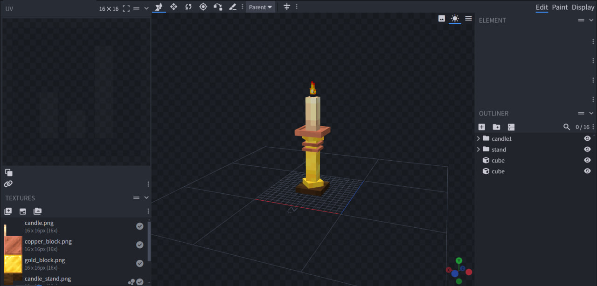
 
 2. Не забудьте виставити налаштування відображення предмета в руці гравця
 
 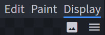
 
 3. Експортуйте модель як `Block/item model`
 
 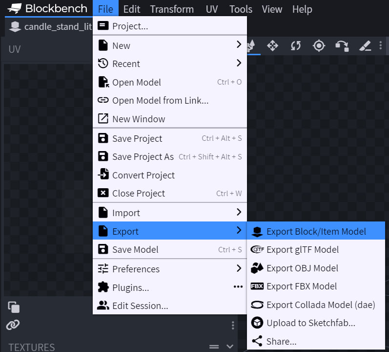

 4. Тепер у вас є `.json` файл моделі. Та файли текстур, якщо ви їх створювали, а не вставляли звідкись. Незалежно від того звідки текстури, переконайтеся, що маєте їх файли, бо їх ще треба буде використовувати в ресурспаці. 
 
 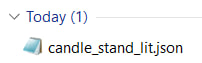
 
 5. Далі наведено схематичне зображення того, що ми будемо створювати. Файл маппінгу(певного предмета) вказує, яка модель повинна рендеритись, зважаючи на певні умови. Кожна модель вказує на свої текстури.
 
 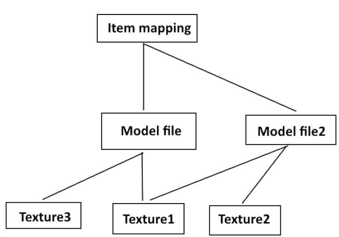
 
 6. Почнемо з текстур. Перейдіть в папку `assets/minecraft/textures`.
 Якщо ваша текстура намальована вами, закиньте її в папку `_custom`.
 Якщо ви використовуєте ванільну текстуру, закиньту її в папку `_vanilla_block`(чи `_vanilla_item` і так далі).
 
 6.1. Можливо у вас є питання "Навіщо дублювати ванільні текстури, якщо вони і так підтягнуться з гри?".
 Деякі гравці користуються кастомними ресурспаками, які змінюють вигляд ванільних предметів і блоків.
 В такому випадку, ваша модель отримає від гри зовсім іншу текстуру. Щоб цього не сталося ми дублюємо ванільні текстури.
 
 7. Відкрийте файл `assets/minecraft/atlases/blocks.json`.
 Допишіть у нього рядок, який вказуватиме на вашу текстуру.
 Переконайтеся, що ви не залишили кому після останнього запису.
 
 Якщо кілька текстур - дописуйте кілька рядків.
 Якщо у вас текстура ванільного блока, який вже був в ресурспаці до вас - не дописуйте нічого, там вже є рядок для цієї текстури.
 
 
 
 Навіщо цей крок? Майнкрафт вимагає, щоб ресурспак мав атлас усіх текстур. Раніше його не було, тепер є. Так і живемо.
 
 8. Перейдемо до додавання файлу моделі. Перейдіть в папку `assets/minecraft/models/_custom`.
 Створіть для себе папку зі своїм нікнеймом та закиньте туди `.json` файл, який ви отримали після експорту в третьому кроці.
 
 8.1. Відкрийте ваш файл моделі та погляньте на список використаних текстур.
 
 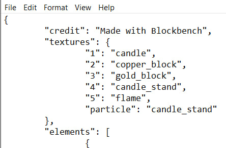
 
 Потрібно зробити, щоб ваш список текстур вказував на адресу відповідних файлів текстур, які ви додавали раніше.
 
 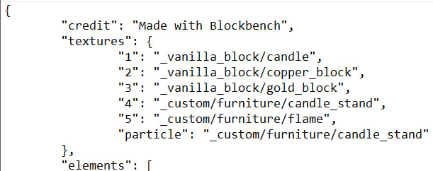
 
 9. Перейдемо файла маппінгу.
 Відкрийте папку `assets/minecraft/models/item`.
 Кожен файл в цій папці містить інформацію про те, яка модель має рендеритись замість самого предмета(зважаючи на умови типу CustomModelData, time чи інші). 
 
 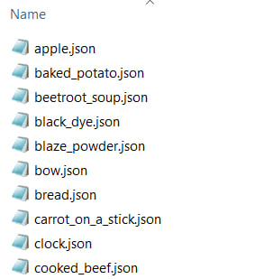
 
 10. Відкрийте файл предмета, який ви хочете замінити. Якщо його ще немає, то потрібно створити.
 
 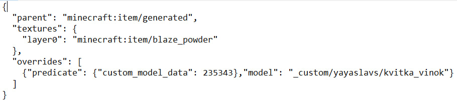
 
 Допишіть до початку списку рядок, що вказуватиме на файл вашої моделі.
 Переконайтеся, що ваше число CustomModelData нижче на 1 від попереднього запису.
 
 
 
 11. Вітаємо, все готово. Як отримати тепер цей предмет в грі?
 `/give @s blaze_powder[custom_model_data=123]`
 Команду відповідно змініть під ваш предмет та число.
 
 # Як додати кастомну текстуру предмета в ресурспак
 Різниця від моделі полягає в тому, що це буде предмет модель якого динамічно генерується грою, використовуючи ваше зображення.
 Все що вам треба надати це файл зображення.
 Прикладом такого є фактично будь-який предмет в майнкрафті.
 Файл діамантового меча це зображення, але гра відображає його як тривимірну модель.
 
 1. Додайте текстуру так само як вказано вище в пунктах 6,7.
 
 2. Перейдіть в папку `assets/minecraft/models/_custom` та у вашу папку моделей.
 В ній створіть файл вашої моделі.
 Можете скопіювати вже існуючий в іншій папці та змінити його назву і адресу текстури.
 
 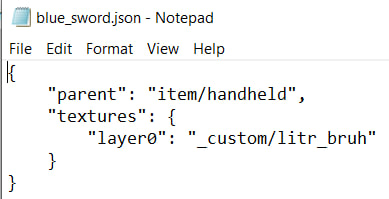
 
 Зверніть увагу, що замість `"parent": "item/handheld"` можна використовувати `"parent": "item/generated"`.
 Просте пояснення - `handheld` для мечів, `generated` для лука. 
 
 2.1. Також опціонально ви навіть можете відкрити ваш файл в блокбенчі і додатково налаштувати йому параметри відображення.
 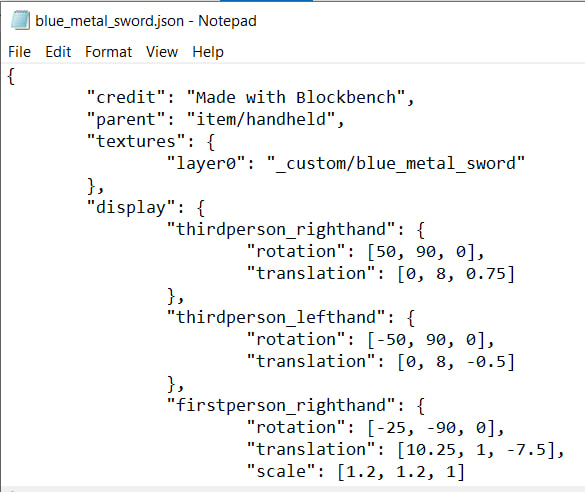
 
 3. Змініть файл маппінгу, як раніше було вказано в пунктах 9,10.
 
 4. Готово